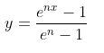

# Premium Refund Calculator
This calculator accurately calculate the unearned premium based on **SEVEN** input parameters by applying the actuarial reserving method. **SIX** out of **SEVEN** parameters can be found in the database and one required manual input from the end user.

### Table of Contents

    
click to expand

    
* [Running RESTful API](#running-restful-api)
	* [Prerequisites](#prerequisites)
	* [Data format](#data-format)
    * [Definition of Parameters](#definition-of-parameters)
* [Running Web Application](#running-Web-application)
* [Calculation Methodology](#calculation-methodology)
	* [Summary](#summary)
	* [Start Day portion](#start-day-portion)
    * [Trip Duration portion](#trip-duration-portion)
    * [Lead Time portion](#lead-time-portion)
    

## Running RESTful API
### Prerequisites
You must have python3.7.4 and above install. Other required packages can be aquired via: 
`pip install -r requirements.txt` 

To run the service: 
`python RESTful_API.py`

### Data format
The service take a json post request and returned the refund amount. The data **must** be in the the following structure: 
`{"premium"   : $$$.$$,` 
`'issue_date'   : 'yyyy-mm-dd HH:MM:SS',` 
`'start_date'   : 'yyyy-mm-dd HH:MM:SS',` 
`'end_date'     : 'yyyy-mm-dd HH:MM:SS',` 
`'request_date' : 'yyyy-mm-dd HH:MM:SS',` 
`'prd_grp_fin'  : 'E-comm',` 
`'policy_id'    : 'XXXXX'}` 

Example to post a request via python is in `request.py`.

### Definition of Parameters:
1. `premium`      - The original GWP/Premmium charged to the policyholders/customers.
2. `issue_date`   - The date when the policy is underwritten.
3. `start_date`   - The initial start date of the trip/journey.
4. `end_date`     - The expiry date of the policy or when the policy become ineffective.
5. `request_date` - The date in which refund begain to take effect from.
6. `prd_grp_fin`  - Segmentation information provided by B.I.
7. `policy_id`    - The identifying id for the request policy. (This is for logging and debugging purpose)

## Running Web Application
`python webapp.py`

## Calculation Methodology
All necessary function for calculation is in `calculator.py`. 

### Summary
When a policy is issued, the premium collected is earned on the term of the policy until it expired.
The eanring has a unique pattern according to the risk involved within the policy term.

The reserving actuary has came out with a unique earning pattern for each `Product Group` to reflect each homogenous segment.
With this unique pattern we can indentified how much risk has expired or earned and how much is still in effect.
When a refund is needed we can safely refund the portion that hasn't expired or earned yet.
Hence the porportion of refund is just `1-earned`.

<ins>The earned calculation are made up of :</ins>

1. Start Day portion
2. Trip Duration portion
3. Lead time portion

### Start Day portion
The start day portion are constant set by the reserving actuary as:

| Product Group Finance | Start Day portion |
| --------------------- | ----------------- |
|      Ticket           | 0.360211775       |
|      E-comm           | 0.047960282       |
|      Corporate        | 0.                |
|      Cancellation     | 0.241505279       |
|      Trad & Other     | 0.054981764       |

### Trip Duration portion
Trip duration portion can either be earned on a pro-rata linear scale or on a log scale.
The general rule of thumb is to use log scale when trip duration is relatively long as compare to lead time. 
Vice-versa on a linear scale when trip duration is relatively short as compare to lead time.
The exact threshold can be found in the `calculator.py` which follows the reserving document.

### Lead Time portion
Lead time portion are calculated using a special formula:

where coeficient n can be found in the documentation.

##### *Please contact the actuarial reserving team if you required a copy of the documentation.*

