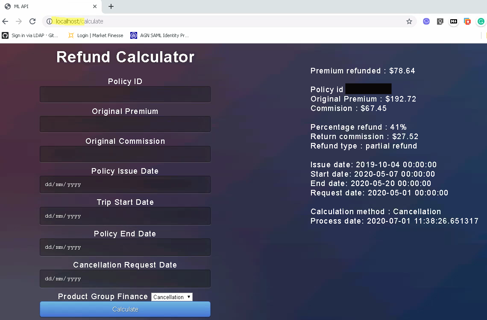
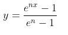

# Premium Refund Calculator
This calculator accurately calculates the unearned premium based on **SEVEN** input parameters by applying the actuarial reserving method.
**SIX** out of **SEVEN** parameters can be found in the database and one required manual input from the end-user.

### Table of Contents

    
* [Deployment](#deployment)
	* [1. Run directly on terminal](#1-run-directly-on-terminal)
	* [2. Run as docker container](#2-run-as-docker-container)
* [Web Application](#web-application)
* [RESTful API](#restful-api)  
	* [Data format](#data-format)
    * [Definition of Parameters](#definition-of-parameters)
* [Calculation Methodology](#calculation-methodology)
	* [Summary](#summary)
	* [Start Day portion](#start-day-portion)
    * [Trip Duration portion](#trip-duration-portion)
    * [Lead Time portion](#lead-time-portion)
    


## Deployment
The service can be deployed directly via terminal or run as a docker container.

### 1. Run directly on terminal
You must have python3.7 or above install. Other required packages can be acquired via:<br>
`pip install -r requirements.txt`<br>

To run the service:<br>
`python run.py`

### 2. Run as docker container
Build the docker image using the docker file provided in this repository by `docker build -t <image name> .`. 
Then simple run `docker run -p <port to map>:5000 <image name>`.

## Web Application
Go to your web browser and type in `localhost`:<br>
<p align="center">
  
</p>

## RESTful API
The API take an input with a specific data format and return a json result.
To achieve a batch processing, you may engage the API is a loop.<br>
API url as follow: `http://localhost:500/calculate_api`<br>
Example to post a request via python is in `request.py`.

### Data format
The data **must** be in the the following structure:<br>
```
{'policy_id'    : 'XXXXX'
 "premium"      : '192.72',
 "commission"   : '67.45', 
 'issue_date'   : 'yyyy-mm-dd',
 'start_date'   : 'yyyy-mm-dd',
 'end_date'     : 'yyyy-mm-dd',
 'request_date' : 'yyyy-mm-dd',
 'prd_grp_fin'  : 'Cancellation'}
```

### Definition of Parameters:
1. `premium`      - The original GWP/Premium charged to the policyholders/customers.
3. `commission`   - The original Commission charged on the policy.
4. `issue_date`   - The date when the policy is underwritten.
5. `start_date`   - The initial start date of the trip/journey.
6. `end_date`     - The expiry date of the policy or when the policy becomes ineffective.
7. `request_date` - The date in which refund begins to take effect a.k.a. cancellation request date.
8. `prd_grp_fin`  - Segmentation information related to the product.
9. `policy_id`    - The identifying id for the request policy. (This is for logging and debugging purpose)

## Calculation Methodology
All necessary function for calculation is in `calculator.py`. For example:<br>
```
import calculator as cal

earned = cal.function(issue_date, start_Date, end_date, request_date, prd_grp_fin)
Premium_refunded = round(Original_premium*(1-earned),2)
```
### Summary
When a policy is issued, the premium collected is earned on the term of the policy until it expired.
The earning has a unique pattern according to the risk involved within the policy term.

The reserving actuary has come out with a unique earning pattern for each `Product Group` to reflect each homogenous segment.
With this unique pattern, we can identify how much risk has expired or earned and how much is still in effect.
When a refund is needed, we can safely refund the portion that hasn't expired or earned yet.
Hence the proportion of refund is just `1-earned`.

<ins>The earned calculation are made up of :</ins>

1. Start Day portion
2. Trip Duration portion
3. Lead time portion

### Start Day portion
The start day portion is a constant set by the reserving actuary as:

| Product Group Finance | Start Day portion |
| --------------------- | ----------------- |
|      Ticket           | 0.360211775       |
|      E-comm           | 0.047960282       |
|      Corporate        | 0.                |
|      Cancellation     | 0.241505279       |
|      Trad & Other     | 0.054981764       |


### Trip Duration portion
Trip duration portion can either be earned on a pro-rata linear scale or a log scale.
The general rule of thumb is to use log scale when the trip duration is relatively long as compared to lead time; vice-versa on a linear scale when the trip duration is relatively short as compared to lead time.
The exact threshold can be found in the `calculator.py` which follows the reserving document.

### Lead Time portion
Lead time portion is calculated using a special formula:
<p align="center">
  
</p>

where the coeficient n can be found in the documentation.

##### *Please contact the actuarial reserving team if you require a copy of the documentation.*
## 
<h6 align="center">
&copy; Quantuary 2020
</h6>
